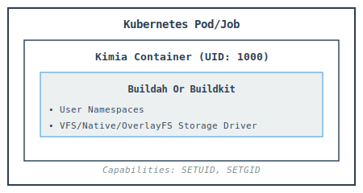

# Kimia - Kubernetes-Native OCI Image Builder
### Daemonless. Rootless. Privilege-free. Fully OCI-compliant.
<div align="center">
<p>
  <a href="https://opensource.org/licenses/MIT"></a>
  <a href="https://kubernetes.io/"></a>
  <a href="https://golang.org/"></a>
  <a href="https://ghcr.io/rapidfort/kimia"></a>
</p>

**[Quick Start](#quick-start)** • **[Documentation](#command-line-reference)** • **[Examples](#examples)** • **[Contributing](#contributing)**

</div>

---

## What is Kimia?

Kimia is a **Kubernetes-native, OCI-compliant container image builder** designed for secure, daemonless builds in cloud environments.

Built on proven container technologies, Kimia provides enhanced security through rootless operation and user namespace isolation.

### Key Features

🔒 **Security First**
- **Rootless by Design** - Runs as non-root user (UID 1000)
- **User Namespace Isolation** - Complete separation from host system
- **Minimal Capabilities** - Only SETUID & SETGID required
- **No Privileged Mode** - Works without elevated permissions
- **Image Signing & Attestations** - Built-in Cosign integration with SBOM & Provenance

☁️ **Cloud Native**
- **Kubernetes Native** - Designed for K8s from the ground up
- **GitOps Ready** - Works with ArgoCD, Flux, Tekton, Jenkins
- **Multi-Platform** - Supports AWS EKS, GCP GKE, Azure AKS, OpenShift
- **OCI Compliant** - Standards-based image building

🚀 **Developer Friendly**
- **Kaniko Argument Compatible** - Familiar command-line interface
- **Git Integration** - Build directly from repositories
- **Layer Caching** - Fast, efficient rebuilds
- **Standard Dockerfiles** - No special syntax required

---

## Documentation

### Core Documentation
- [Build Isolation & Security Guide](docs/security.md) - Comprehensive security practices
- [CLI Reference](docs/cli-reference.md) - Complete command-line documentation
- [Attestation & Signing](docs/attestation-signing.md) - SBOM, Provenance, and Cosign integration
- [Installation](docs/installation.md) - Platform-specific setup
- [Examples](docs/examples.md) - Common use cases and patterns

### Advanced Topics
- [Reproducible Builds](docs/reproducible-builds.md) - Supply chain security
- [Performance Optimization](docs/performance.md) - Caching and tuning
- [Troubleshooting](docs/troubleshooting.md) - Common issues and solutions
- [Comparison with Kaniko](docs/comparison.md) - Feature comparison

### Integration Guides
- [GitOps Integration](docs/gitops.md) - ArgoCD, Flux, Tekton, Jenkins
- [FAQ](docs/faq.md) - Frequently asked questions

---

## Architecture

Kimia uses Linux user namespaces to provide true rootless operation:

```
Host System (Real)          User Namespace (Mapped)
─────────────────          ───────────────────────
UID 1000 (kimia)     ───►  UID 0 (appears as root)
UID 100000           ───►  UID 1
UID 100001           ───►  UID 2
     ...                        ...
UID 165535           ───►  UID 65535
```


**Even if a container escapes, it only has unprivileged user access on the host.**

### Two Variants

Kimia is available in two variants, both providing the same security guarantees:

| Variant | Base Technology | Image Name | Best For |
|---------|----------------|------------|----------|
| **Kimia** | BuildKit | `ghcr.io/rapidfort/kimia` | Maximum compatibility, Moby ecosystems |
| **Kimia-Bud** | Buildah | `ghcr.io/rapidfort/kimia-bud` | Light, Buildah ecosystem |

Both variants:
- Support the same Kimia command-line arguments
- Provide identical security properties
- Are fully OCI-compliant
- Support multi-architecture builds
- Reproducible builds

---

## Quick Start

### Prerequisites

- Kubernetes 1.21+
- User namespaces enabled on nodes
- Container registry credentials

**Enable user namespaces on your nodes:**

```bash
# Check if enabled
cat /proc/sys/user/max_user_namespaces

# Enable if needed (value should be > 0)
sudo sysctl -w user.max_user_namespaces=15000

# Make persistent
echo "user.max_user_namespaces=15000" | sudo tee -a /etc/sysctl.conf
```

### Basic Build Example

Create a Kubernetes Job to build and push an image:

```yaml
apiVersion: batch/v1
kind: Job
metadata:
  name: kimia-build
spec:
  ttlSecondsAfterFinished: 3600
  template:
    spec:
      restartPolicy: Never
      securityContext:
        runAsNonRoot: true
        runAsUser: 1000
        fsGroup: 1000
      containers:
      - name: kimia
        image: ghcr.io/rapidfort/kimia
        args:
        - --context=https://github.com/nginx/docker-nginx.git
        - --dockerfile=mainline/alpine/Dockerfile
        - --destination=myregistry.io/nginx:latest
        - --no-push
        securityContext:
          allowPrivilegeEscalation: true
          capabilities:
            drop: [ALL]
            add: [SETUID, SETGID]
          appArmorProfile:
            type: Unconfined
          seccompProfile:
            type: Unconfined
```

### Create Registry Credentials

```bash
# From existing Docker config
kubectl create secret generic registry-credentials \
  --from-file=.dockerconfigjson=$HOME/.docker/config.json \
  --type=kubernetes.io/dockerconfigjson

# Or create manually
kubectl create secret docker-registry registry-credentials \
  --docker-server=myregistry.io \
  --docker-username=myuser \
  --docker-password=mypassword
```

### Deploy and Monitor

```bash
# Deploy the build job
kubectl apply -f kimia-build.yaml

# Watch job status
kubectl get jobs -w

# View build logs
kubectl logs job/kimia-build -f
```

---

## Command Line Arguments

Kimia supports a comprehensive set of command-line arguments. Key options include:

### Core Arguments

| Argument | Description | Example |
|----------|-------------|---------|
| `-c, --context` | Build context (directory or Git URL) | `--context=.` |
| `-f, --dockerfile` | Path to Dockerfile | `--dockerfile=Dockerfile` |
| `-d, --destination` | Target image (repeatable) | `--destination=myapp:latest` |
| `-t, --target` | Multi-stage build target | `--target=builder` |
| `--context-sub-path` | Subdirectory within context | `--context-sub-path=app` |

### Build Options

| Argument | Description | Default |
|----------|-------------|---------|
| `--build-arg` | Build-time variables (repeatable) | - |
| `--cache` | Enable layer caching | `false` |
| `--cache-dir` | Custom cache directory | - |
| `--storage-driver` | Storage backend (native\|overlay) | `native` |
| `--label` | Image labels (repeatable) | - |

### Output Options

| Argument | Description |
|----------|-------------|
| `--no-push` | Build without pushing to registry |
| `--tar-path` | Export image to TAR file |
| `--digest-file` | Write image digest to file |
| `--image-name-with-digest-file` | Write full image reference |

### Attestation & Signing

| Argument | Description | Example |
|----------|-------------|---------|
| `--attestation` | Simple mode (off\|min\|max) | `--attestation=min` |
| `--attest` | Docker-style attestations | `--attest type=sbom` |
| `--sign` | Sign image with Cosign | `--sign` |
| `--cosign-key` | Cosign private key path | `--cosign-key=/keys/key` |

### Git Options

| Argument | Description |
|----------|-------------|
| `--git-branch` | Git branch to checkout |
| `--git-revision` | Git commit SHA |
| `--git-token-file` | Git token for private repos |
| `--git-token-user` | Git token username |

### Registry Options

| Argument | Description |
|----------|-------------|
| `--insecure` | Allow insecure connections |
| `--insecure-pull` | Allow insecure base image pulls |
| `--insecure-registry` | Skip TLS for specific registry |
| `--push-retry` | Number of push retry attempts |
| `--image-download-retry` | Number of image download retries |
| `--registry-certificate` | Custom registry certificate |

### Reproducible Builds

| Argument | Description | Example |
|----------|-------------|---------|
| `--reproducible` | Enable reproducible builds | `--reproducible` |
| `--timestamp` | Set build timestamp (Unix epoch) | `--timestamp=1609459200` |

> **Note:** `--timestamp` automatically enables `--reproducible`. Supports `SOURCE_DATE_EPOCH` env var.

### Logging & Debug

| Argument | Description | Default |
|----------|-------------|---------|
| `-v, --verbosity` | Log level (debug\|info\|warn\|error) | `info` |
| `--log-timestamp` | Add timestamps to logs | `false` |

### Advanced Options

| Argument | Description |
|----------|-------------|
| `--buildkit-opt` | Pass options directly to BuildKit |

**Full reference:** See [CLI Reference](docs/cli-reference.md) for complete documentation.

## Kaniko users: Kimia supports most Kaniko arguments - see [Comparison Guide](docs/comparison.md) for details.


## Storage Drivers

Kimia supports two storage drivers:

| Driver | Description | Best For | Requirements |
|--------|-------------|----------|--------------|
| **native** (default) | VFS-based storage | Maximum compatibility, TAR exports | None |
| **overlay** | OverlayFS-based | Performance, production builds | Kernel support |

```bash
# Use overlay driver for better performance
kimia --context=. --destination=myapp:latest --storage-driver=overlay

# Use native for TAR exports
kimia --context=. --tar-path=/output/image.tar --storage-driver=native --no-push
```

---

## Security

Kimia provides defense-in-depth security through multiple layers:

### Security Features

✅ **Rootless Operation**
- Runs as non-root user (UID 1000)
- No root privileges required on host

✅ **User Namespace Isolation**
- Container UID 0 → Host UID 1000 (unprivileged)
- Additional security boundary

✅ **Minimal Capabilities**
- Only SETUID & SETGID capabilities required
- All other capabilities dropped

✅ **No Privileged Mode**
- Works without `privileged: true`
- Compliant with Pod Security Standards (Restricted*)

✅ **Daemonless**
- No Docker/Podman daemon required
- Reduced attack surface

*Requires `allowPrivilegeEscalation: true` for user namespace operations

### Security Best Practices

```yaml
securityContext:
  # Pod-level security
  runAsNonRoot: true
  runAsUser: 1000
  fsGroup: 1000
  seccompProfile:
    type: RuntimeDefault

containers:
- name: kimia
  securityContext:
    # Container-level security
    runAsUser: 1000
    allowPrivilegeEscalation: true  # Required for user namespaces
    capabilities:
      drop: [ALL]
      add: [SETUID, SETGID]  # Minimal capabilities
    seccompProfile:
      type: RuntimeDefault
```

**Detailed security documentation:** [Security Guide](docs/security.md)

---

## Reproducible Builds

Kimia supports reproducible builds for supply chain security and compliance.

### Shared Responsibility Model

Reproducible builds require collaboration between your build configuration and Kimia:

**Your Responsibility:**
- 📌 Pin base image digests (e.g., `FROM alpine@sha256:...`)
- 📌 Pin package versions in Dockerfile
- 📌 Use fixed versions for external dependencies

**Kimia's Responsibility:**
- 🔧 Normalize file timestamps
- 🔧 Sort build arguments and labels
- 🔧 Use deterministic metadata
- 🔧 Disable caching (optional but recommended)

### Usage

```bash
# Reproducible build with epoch 0 (default)
kimia --context=. --destination=myapp:v1 --reproducible

# Reproducible build with custom timestamp
kimia --context=. --destination=myapp:v1 --timestamp=1609459200

# Use git commit timestamp for versioning
export SOURCE_DATE_EPOCH=$(git log -1 --format=%ct)
kimia --context=. --destination=myapp:v1 --reproducible
```

**Complete guide:** [Reproducible Builds Documentation](docs/reproducible-builds.md)

---

## Attestation & Signing

Kimia provides built-in support for generating attestations and signing container images with Cosign, enabling supply chain security and compliance.

### Features

✅ **SBOM (Software Bill of Materials)**
- Complete inventory of packages and dependencies
- SPDX 2.3 format
- Vulnerability scanning support

✅ **Provenance (Build Information)**
- SLSA compliance
- Verifiable build metadata
- Complete audit trail

✅ **Image Signing**
- Sigstore Cosign integration
- Cryptographic verification
- Manifest list signing

### Quick Example

```yaml
apiVersion: batch/v1
kind: Job
metadata:
  name: kimia-build-signed
spec:
  template:
    spec:
      restartPolicy: Never
      containers:
        - name: kimia
          image: ghcr.io/rapidfort/kimia:latest
          args:
            - --context=https://github.com/myorg/myapp.git
            - --destination=registry.io/myapp:v1
            - --attestation=max          # Generate SBOM + Provenance
            - --sign                     # Sign with Cosign
            - --cosign-key=/secrets/cosign.key
            - --cosign-password-env=COSIGN_PASSWORD
          env:
            - name: COSIGN_PASSWORD
              valueFrom:
                secretKeyRef:
                  name: cosign-keys
                  key: password
          volumeMounts:
            - name: cosign-key
              mountPath: /secrets
              readOnly: true
      volumes:
        - name: cosign-key
          secret:
            secretName: cosign-keys
```

### Verification

```bash
# Verify image signature
cosign verify --key cosign.pub registry.io/myapp:v1

# Inspect attestations
crane manifest registry.io/myapp:v1 | jq .
```

**Complete guide:** [Attestation & Signing Documentation](docs/attestation-signing.md)


## Installation

### Platform-Specific Setup

- **[AWS EKS](docs/installation.md#aws-eks)** - Works out of the box on standard EKS
- **[Google GKE](docs/installation.md#google-gke)** - User namespaces enabled by default
- **[Azure AKS](docs/installation.md#azure-aks)** - Enable via nodepool configuration
- **[Red Hat OpenShift](docs/installation.md#red-hat-openshift)** - Available on OpenShift 4.7+

**Full installation guide:** [Installation Documentation](docs/installation.md)

---

## Contributing

We welcome contributions! Please see our [Contributing Guide](CONTRIBUTING.md) for details.

```bash
# Clone and build
git clone https://github.com/rapidfort/kimia.git
cd kimia
make build

# Run tests
make test
```

---

## License

Kimia is licensed under the [MIT License](LICENSE).

---

## Support

- 📝 [GitHub Issues](https://github.com/rapidfort/kimia/issues) - Bug reports and feature requests
- 💬 [Discussions](https://github.com/rapidfort/kimia/discussions) - Questions and community support
- 📧 Email: support@rapidfort.com

---

## Acknowledgments

- Built on [Buildah](https://github.com/containers/buildah) - A tool that facilitates building OCI images.
- Built on [Buildkit](https://github.com/moby/buildkit) - concurrent, cache-efficient, and Dockerfile-agnostic builder toolkit
- Inspired by [Kaniko](https://github.com/GoogleContainerTools/kaniko) - Pioneering daemonless builds
- Container tools from the [Containers](https://github.com/containers) organization
