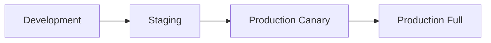

# Kimia vs Kaniko Comparison

Detailed comparison between Kimia and Kaniko for Kubernetes-native container image building.

---

## Feature Comparison

| Feature | Kimia | Kaniko | Advantage |
|---------|--------|--------|-----------|
| **User Context** | Non-root (UID 1000) | Root (UID 0) | ✅ Kimia: Reduced privilege escalation risk |
| **Capabilities Required** | SETUID, SETGID only | None | ⚖️ Kimia: Explicit minimal caps for user namespaces |
| **Docker Daemon** | Not required | Not required | ✅ Equal: No daemon dependencies |
| **Privileged Mode** | Not required | Not required | ✅ Equal: No privileged containers |
| **User Namespaces** | Required & utilized | Not used | ✅ Kimia: Additional isolation layer |
| **Complex Dockerfiles** | Full support | Limited (chown issues) | ✅ Kimia: Better compatibility with ownership changes |
| **Storage Driver** | VFS/Overlay (configurable) | Various | ✅ Kimia: Configurable, consistent |
| **Build Cache** | Layer caching | Layer caching | ✅ Equal: Efficient rebuilds |
| **Registry Authentication** | Multiple methods | Multiple methods | ✅ Equal: Flexible auth options |
| **Multi-stage Builds** | Full support | Full support | ✅ Equal: Modern Dockerfile features |
| **Git Integration** | Built-in (via args) | Built-in (via executor) | ✅ Equal: Both support Git directly |
| **Attack Surface** | Minimal (rootless) | Larger (root) | ✅ Kimia: Significantly reduced |
| **Pod Security Standards** | Restricted-compliant* | Baseline only | ✅ Kimia: Higher security standard |
| **Build Performance** | Fast (native) | Fast (native) | ✅ Equal: Both performant |
| **Cross-platform Builds** | ✅ Supported | ✅ Supported | ✅ Equal: Multi-arch capable |
| **Secrets Handling** | Buildah secrets | Kaniko secrets | ✅ Equal: Secure secret management |
| **Resource Efficiency** | Lightweight | Lightweight | ✅ Equal: Minimal overhead |
| **Reproducible Builds** | ✅ Built-in | Manual setup | ✅ Kimia: Native support |

*With `allowPrivilegeEscalation: true` for user namespace operations

---

## Key Security Advantages

### 1. Rootless Architecture

**Kimia - Non-root by design:**
```yaml
securityContext:
  runAsUser: 1000
  runAsNonRoot: true
```

**Kaniko - Runs as root:**
```yaml
securityContext:
  runAsUser: 0  # Root user
```

**Impact:** Even if the container is compromised, an attacker only has unprivileged user access with Kimia, whereas Kaniko running as root poses higher risk.

### 2. User Namespace Isolation

**Kimia:**
```
Container UID 0 → Host UID 1000 (unprivileged)
Container UID 1 → Host UID 100000
Container UID 2 → Host UID 100001
```

**Kaniko:**
```
Container UID 0 → Host UID 0 (if container escape occurs)
```

**Impact:** Kimia provides an additional security boundary through user namespaces. If a container escape occurs, the attacker is still mapped to an unprivileged user on the host.

### 3. Explicit Capability Model

**Kimia - Minimal explicit capabilities:**
```yaml
capabilities:
  drop: [ALL]
  add: [SETUID, SETGID]  # Only for user namespaces
```

**Kaniko - No capabilities explicitly needed:**
```yaml
capabilities:
  drop: [ALL]
  # No capabilities added - runs as root instead
```

**Impact:** Kimia's approach is more transparent about security requirements. The SETUID and SETGID capabilities are specifically for user namespace creation, which is much safer than running as root.

---

## Compatibility Advantages

### Complex Dockerfile Operations

**Kimia** handles complex ownership changes better:

```dockerfile
# This works reliably in Kimia
FROM ubuntu:22.04
RUN useradd -m -u 1001 appuser
COPY --chown=appuser:appuser . /app
RUN chown -R appuser:appuser /app
USER appuser
```

**Kaniko** may have issues with certain chown operations in unprivileged scenarios.

### Docker-Specific Instructions

Kimia supports Docker-specific Dockerfile instructions via `BUILDAH_FORMAT`:

```dockerfile
# These work with BUILDAH_FORMAT=docker
HEALTHCHECK --interval=30s CMD curl -f http://localhost/ || exit 1
SHELL ["/bin/bash", "-c"]
STOPSIGNAL SIGTERM
```

---

## Argument Compatibility

Most Kaniko arguments work directly with Kimia:

| Kaniko Argument | Kimia Equivalent | Compatibility |
|-----------------|------------------|---------------|
| `--context` | `--context` | ✅ 100% |
| `--dockerfile` | `--dockerfile` | ✅ 100% |
| `--destination` | `--destination` | ✅ 100% (repeatable) |
| `--build-arg` | `--build-arg` | ✅ 100% |
| `--target` | `--target` | ✅ 100% |
| `--cache` | `--cache` | ✅ 100% |
| `--cache-dir` | `--cache-dir` | ✅ 100% |
| `--insecure` | `--insecure` | ✅ 100% |
| `--skip-tls-verify` | `--skip-tls-verify` | ✅ 100% |
| `--verbosity` | `--verbosity` | ✅ 100% |
| `--label` | `--label` | ✅ 100% |
| `--git` | `--context=git://...` | ✅ Compatible |
| `--snapshot-mode` | N/A | ℹ️ VFS handles this |
| `--use-new-run` | N/A | ℹ️ Buildah default |
| `--reproducible` | `--reproducible` | ✅ Native support |

---

## When to Choose Kimia

### ✅ Choose Kimia When:

1. **Security is Paramount**
   - Defense-in-depth security required
   - Compliance mandates rootless containers
   - Need Pod Security Standard "Restricted" compliance
   - Regulatory requirements (PCI-DSS, HIPAA, SOC 2)

2. **Complex Build Requirements**
   - Dockerfiles with complex ownership operations
   - Need for `chown` operations
   - Docker-specific instructions (HEALTHCHECK, SHELL)

3. **Reproducible Builds**
   - Supply chain security requirements
   - Need byte-for-byte identical builds
   - Compliance verification needed

4. **Modern Kubernetes Environments**
   - User namespaces already enabled
   - Pod Security Standards enforced
   - Security-first organization

### ⚠️ Consider Kaniko When:

1. **Infrastructure Limitations**
   - User namespaces cannot be enabled on nodes
   - Legacy Kubernetes versions (<1.21)
   - Restricted node configuration access

2. **Minimal Change Required**
   - Existing Kaniko pipelines work well
   - No time for migration
   - Team familiarity with Kaniko

3. **Quick Start Priority**
   - Need immediate deployment
   - No time for user namespace setup
   - Testing/development environments only

---

## Migration from Kaniko to Kimia

### Step-by-Step Migration Guide

#### 1. Verify Prerequisites

```bash
# Check user namespace support
kubectl run test --rm -it --image=busybox --restart=Never -- \
  cat /proc/sys/user/max_user_namespaces

# Should return > 0 (typically 15000)
```

#### 2. Test Side-by-Side

Run both builders in parallel to compare:

**Kaniko Job:**
```yaml
apiVersion: batch/v1
kind: Job
metadata:
  name: kaniko-test
spec:
  template:
    spec:
      containers:
      - name: kaniko
        image: gcr.io/kaniko-project/executor:latest
        args:
        - --context=git://github.com/org/repo.git
        - --destination=myregistry.io/myapp:kaniko
        volumeMounts:
        - name: docker-config
          mountPath: /kaniko/.docker/
      volumes:
      - name: docker-config
        secret:
          secretName: registry-credentials
```

**Kimia Job:**
```yaml
apiVersion: batch/v1
kind: Job
metadata:
  name: kimia-test
spec:
  template:
    spec:
      securityContext:
        runAsNonRoot: true
        runAsUser: 1000
        fsGroup: 1000
      containers:
      - name: kimia
        image: ghcr.io/rapidfort/kimia:latest
        args:
        - --context=git://github.com/org/repo.git
        - --destination=myregistry.io/myapp:kimia
        securityContext:
          allowPrivilegeEscalation: true
          capabilities:
            drop: [ALL]
            add: [SETUID, SETGID]
        volumeMounts:
        - name: docker-config
          mountPath: /home/kimia/.docker/
      volumes:
      - name: docker-config
        secret:
          secretName: registry-credentials
```

#### 3. Update Security Context

Key changes needed in your manifests:

```yaml
# Before (Kaniko)
spec:
  containers:
  - name: kaniko
    image: gcr.io/kaniko-project/executor:latest

# After (Kimia)
spec:
  securityContext:
    runAsNonRoot: true
    runAsUser: 1000
    fsGroup: 1000  # Important for cache permissions
  containers:
  - name: kimia
    image: ghcr.io/rapidfort/kimia:latest
    securityContext:
      allowPrivilegeEscalation: true
      capabilities:
        drop: [ALL]
        add: [SETUID, SETGID]
```

#### 4. Update Volume Mounts

```yaml
# Before (Kaniko)
volumeMounts:
- name: docker-config
  mountPath: /kaniko/.docker/

# After (Kimia)
volumeMounts:
- name: docker-config
  mountPath: /home/kimia/.docker/
```

#### 5. Add Docker Format (If Needed)

If your Dockerfile uses Docker-specific instructions:

```yaml
env:
- name: BUILDAH_FORMAT
  value: "docker"
```

#### 6. Test Build Compatibility

```bash
# Deploy Kimia build
kubectl apply -f kimia-build.yaml

# Monitor logs
kubectl logs -f job/kimia-build

# Verify image
docker pull myregistry.io/myapp:kimia
docker inspect myregistry.io/myapp:kimia
```

#### 7. Performance Comparison

```bash
# Kaniko build time
kubectl logs job/kaniko-test | grep "Built"

# Kimia build time
kubectl logs job/kimia-test | grep "Built"

# Compare image sizes
docker images myregistry.io/myapp --format "table {{.Tag}}\t{{.Size}}"
```

#### 8. Gradual Rollout



1. **Development:** Test Kimia with dev builds
2. **Staging:** Run Kimia for staging deployments
3. **Production Canary:** 10% of production builds
4. **Production Full:** Complete migration

---

## Quick Migration Checklist

- [ ] Verify user namespaces enabled on nodes
- [ ] Test sample build with Kimia
- [ ] Update security contexts in manifests
- [ ] Change volume mount paths
- [ ] Add Docker format if needed (HEALTHCHECK, SHELL)
- [ ] Test cache directory permissions
- [ ] Verify registry authentication works
- [ ] Compare build times and sizes
- [ ] Update CI/CD pipelines
- [ ] Train team on new configuration
- [ ] Update documentation
- [ ] Monitor for issues

---

## Performance Comparison

Based on typical builds:

| Metric | Kimia | Kaniko | Notes |
|--------|-------|--------|-------|
| Build Time | ~Equal | ~Equal | Both use native builds |
| Memory Usage | 2-8 GB | 2-8 GB | Similar resource usage |
| Image Size | Same | Same | Identical output |
| Cache Efficiency | ✅ Excellent | ✅ Excellent | Both support layer caching |
| Startup Time | ~Equal | ~Equal | Similar initialization |

**Verdict:** Performance is comparable; choose based on security requirements.

---

## Cost Comparison

### Kimia

- ✅ Free and open-source (MIT License)
- ✅ No licensing costs
- ✅ Community support
- ✅ Cloud-agnostic

### Kaniko

- ✅ Free and open-source (Apache 2.0)
- ✅ No licensing costs
- ✅ Community support
- ✅ Cloud-agnostic

**Verdict:** Both are free and open-source; no cost difference.

---

## Ecosystem Integration

### Kimia Integrations

- ✅ ArgoCD Workflows
- ✅ Flux
- ✅ Tekton
- ✅ Jenkins
- ✅ GitHub Actions
- ✅ GitLab CI
- ✅ Buildah ecosystem

### Kaniko Integrations

- ✅ ArgoCD Workflows
- ✅ Flux
- ✅ Tekton
- ✅ Jenkins
- ✅ GitHub Actions
- ✅ GitLab CI
- ✅ Google Cloud Build

**Verdict:** Both integrate well with major CI/CD platforms.

---

## Summary

### Choose Kimia If You Need:

- 🔒 **Enhanced Security** - Rootless, user namespaces
- 📋 **Compliance** - Pod Security Standards (Restricted)
- 🔧 **Complex Builds** - Better chown support
- ♻️ **Reproducibility** - Native reproducible builds
- 🛡️ **Defense-in-Depth** - Multiple security layers

### Choose Kaniko If You Have:

- ⚡ **Quick Start** - Simpler initial setup
- 🔒 **Node Restrictions** - Can't enable user namespaces
- 📦 **Existing Pipeline** - Already using Kaniko successfully
- 👥 **Team Familiarity** - Team knows Kaniko well

### Best of Both Worlds:

Many organizations use **both**:
- **Kimia** for production builds (security-critical)
- **Kaniko** for development/testing (faster setup)

---

## Need Help Migrating?

- 📖 [Installation Guide](installation.md) - Setup instructions
- 🎯 [Examples](examples.md) - Migration examples
- 🔧 [Troubleshooting](troubleshooting.md) - Common issues
- ❓ [FAQ](faq.md) - Frequently asked questions

---

[Back to Main README](../README.md) | [Security Guide](security.md) | [CLI Reference](cli-reference.md)
