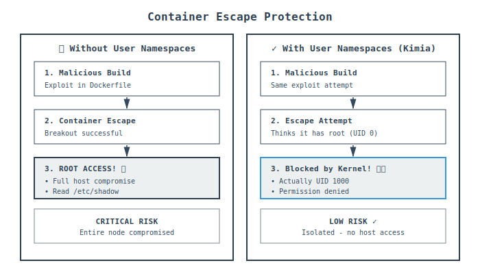

# Kimia Security Guide

Comprehensive security guide for running Kimia in production Kubernetes environments.

---

## Table of Contents

- [Security Architecture Overview](#security-architecture-overview)
- [User Namespace Isolation (Core Security)](#user-namespace-isolation-core-security)
- [Additional Security Layers](#additional-security-layers)
- [Pod Security Configuration](#pod-security-configuration)
- [Operational Security](#operational-security)
- [Verification and Monitoring](#verification-and-monitoring)
- [Troubleshooting](#troubleshooting)
- [Compliance](#compliance)
- [Summary](#summary)

---

## Security Architecture Overview

Kimia provides **defense-in-depth security** through multiple layers, with **user namespace isolation** as the core security mechanism.


### The Five Security Layers

1. **Rootless Pod Execution** - Runs as UID 1000 (non-root)
2. **User Namespace Isolation** ★ - Root inside → UID 1000 outside (critical boundary)
3. **Minimal Capabilities** - Only SETUID & SETGID
4. **Seccomp Profile** - Filters dangerous system calls
5. **Network Policies** - Restricts egress traffic

**Key principle:** Even if one layer is breached, others provide protection.

---

## User Namespace Isolation (Core Security)

User namespaces are Kimia's **primary security mechanism**, creating a hard isolation boundary between the container and the host.

### How It Works


**The magic:** Inside the container, build processes appear to run as root (UID 0), but on the Kubernetes node, they actually run as an unprivileged user (UID 1000).

### UID/GID Mapping


Kimia maps 65,536 UIDs from the container namespace to subordinate UIDs on the host:

```
Container Namespace  →  Host Reality
────────────────────    ────────────
UID 0 (root)         →  UID 1000 (kimia user)
UID 1-65535          →  UID 100000-165535
```

### Process Flow


**Step-by-step:**

1. **Pod Start (T0):** Kubernetes starts the pod as UID 1000
2. **Namespace Creation (T1):** `newuidmap`/`newgidmap` establish mappings
3. **Build Starts (T2):** Process sees itself as root, but host sees UID 1000
4. **Isolated Execution (T3):** Complete security boundary in effect

### Technical Requirements

#### 1. Kernel Support

```bash
# Check if enabled
cat /proc/sys/user/max_user_namespaces
# Should return > 0 (e.g., 15000)

# Enable on each node
sudo sysctl -w user.max_user_namespaces=255851

# Persist across reboots
echo "user.max_user_namespaces=15000" | sudo tee -a /etc/sysctl.conf
```

#### 2. Subordinate UID/GID Ranges

```bash
# /etc/subuid on Kubernetes nodes
kimia:100000:65536

# /etc/subgid on Kubernetes nodes
kimia:100000:65536
```

#### 3. SETUID Helper Binaries

```bash
# These binaries must have SETUID bit
ls -l /usr/bin/newuidmap
-rwsr-xr-x 1 root root 54096 /usr/bin/newuidmap
       ^
       SETUID bit (allows UID mapping)
```

### Security Guarantees



User namespaces create a **hard security boundary**:

| Threat Scenario | Without User Namespaces | With Kimia (User Namespaces) |
|-----------------|-------------------------|------------------------------|
| Container escape | 🔴 Root access to host | 🟢 UID 1000 only |
| Privilege escalation | 🔴 Can gain root | 🟢 Isolated to namespace |
| Host file access | 🔴 Read/write /etc/shadow | 🟢 Blocked by UID mapping |
| Process manipulation | 🔴 Kill any process | 🟢 Cannot affect host processes |
| Network attacks | 🔴 Bind privileged ports | 🟢 Cannot bind < 1024 |
| Kernel operations | 🔴 Load kernel modules | 🟢 Completely blocked |

### Practical Example: Container Escape Attempt

**Malicious Dockerfile:**
```dockerfile
FROM alpine
RUN apk add --no-cache bash curl

# Malicious step - attempt to escape
RUN whoami && \
    cat /proc/1/root/etc/shadow && \
    kill -9 1
```

**What Happens:**

Inside the container (thinks it's root):
```bash
$ whoami
root
$ id
uid=0(root) gid=0(root) groups=0(root)
```

On the host (reality):
```bash
$ ps aux | grep buildkitd
kimia    12345  ... /usr/bin/buildkitd
```

All attack attempts fail:
```bash
$ cat /proc/1/root/etc/shadow
Permission denied

$ kill -9 1
Operation not permitted
```

**Result:** User namespace isolation blocks all privilege escalation attempts.

---

## Additional Security Layers

### 1. Rootless Operation

Kimia runs as **UID 1000 (non-root)**:

```yaml
securityContext:
  runAsNonRoot: true
  runAsUser: 1000
  runAsGroup: 1000
```

**Benefit:** Even if the container is compromised, attackers only have unprivileged user access.

### 2. Minimal Capabilities

Kimia requires **only two Linux capabilities**:

```yaml
capabilities:
  drop: [ALL]
  add: [SETUID, SETGID]  # Only for user namespace operations
```

**Why these capabilities?**
- `SETUID` - Required to create user namespace UID mappings
- `SETGID` - Required to create user namespace GID mappings

**Benefit:** Minimal attack surface (2 of ~40 capabilities).

### 3. No Privileged Mode

Kimia **does not require** `privileged: true`:

```yaml
# ❌ NOT needed
securityContext:
  privileged: true

# ✅ Kimia works with this
securityContext:
  allowPrivilegeEscalation: true  # Only for newuidmap/newgidmap
```

**Note:** `allowPrivilegeEscalation: true` is specifically for SETUID binaries, not root access.

### 4. AppArmor Profile: Unconfined

Kimia requires **AppArmor to be set to Unconfined**:

```yaml
securityContext:
  appArmorProfile:
    type: Unconfined  # Required for user namespace operations
```

**Why Unconfined is required:**
- Default AppArmor profiles may block `unshare()` syscall
- Blocks operations needed for UID/GID mapping setup
- Prevents SETUID binaries from functioning correctly

**What AppArmor typically restricts:**
- Certain mount operations
- Namespace creation syscalls
- File capability operations
- SETUID binary execution

**Security considerations:**
- User namespaces provide the primary security boundary
- Even with Unconfined AppArmor, the container:
  - Runs as UID 1000 (non-root)
  - Has only SETUID/SETGID capabilities
  - Is isolated by user namespace mapping
  - Cannot escalate to real root on host

### 5. Seccomp Profile: Unconfined

Kimia requires **Seccomp to be set to Unconfined**:

```yaml
securityContext:
  seccompProfile:
    type: Unconfined  # Required for unshare() and namespace syscalls
```

**Why Unconfined is required:**
- RuntimeDefault seccomp profile blocks `unshare(CLONE_NEWUSER)`
- Blocks syscalls needed for user namespace creation
- Some `clone()` variations required for containers are filtered

**Critical syscalls that must be allowed:**
```c
unshare(CLONE_NEWUSER)           // User namespace creation
setuid(), setgid(), setgroups()  // UID/GID mapping
clone(CLONE_NEWUSER | CLONE_NEWNS | CLONE_NEWPID)  // Container namespaces
open("/etc/subuid"), open("/etc/subgid")  // Subordinate ID files
```

**Security considerations:**
- User namespace isolation is the primary security mechanism
- Even with Unconfined seccomp:
  - Process runs as unprivileged user (UID 1000)
  - User namespace prevents host access
  - Capabilities limited to SETUID/SETGID only
  - Cannot perform privileged operations on host

### 6. Daemonless Architecture

No Docker or Podman daemon required:
- Reduces attack surface
- No daemon socket exposure
- No shared daemon state
- Isolated build processes

---

## Pod Security Configuration

### Full Restricted Pod Configuration

Kimia requires specific security context settings for user namespace support:

```yaml
apiVersion: v1
kind: Pod
metadata:
  name: kimia-build
  labels:
    app: kimia
spec:
  # Pod-level security
  securityContext:
    runAsNonRoot: true
    runAsUser: 1000
    runAsGroup: 1000
    fsGroup: 1000
  
  containers:
  - name: kimia
    image: ghcr.io/rapidfort/kimia:latest
    args:
      - --context=.
      - --destination=myregistry.io/myapp:latest
    
    # Container-level security - ALL settings required
    securityContext:
      runAsNonRoot: true
      runAsUser: 1000
      allowPrivilegeEscalation: true    # Required for SETUID binaries
      capabilities:
        drop: [ALL]
        add: [SETUID, SETGID]           # Required for user namespace mapping
      appArmorProfile:
        type: Unconfined                # Required for user namespace operations
      seccompProfile:
        type: Unconfined                # Required for unshare() syscall
      readOnlyRootFilesystem: false     # Builds need writable filesystem
    
    resources:
      limits:
        memory: "8Gi"
        cpu: "4"
        ephemeral-storage: "20Gi"
      requests:
        memory: "2Gi"
        cpu: "1"
    
    volumeMounts:
    - name: docker-config
      mountPath: /home/kimia/.docker
      readOnly: true
  
  volumes:
  - name: docker-config
    secret:
      secretName: registry-credentials
```

### Pod Security Standard Compliance

| Restriction | Requirement | Kimia Status |
|-------------|-------------|--------------|
| `runAsNonRoot` | Must be true | ✅ Required (UID 1000) |
| `allowPrivilegeEscalation` | Must be false* | ⚠️ True (for user namespaces) |
| `capabilities` | Can only add SETUID/SETGID | ✅ Only SETUID & SETGID |
| `appArmorProfile` | Must be set | ⚠️ Unconfined (for user namespaces) |
| `seccompProfile` | Must be set | ⚠️ Unconfined (for user namespaces) |
| `privileged` | Must be false | ✅ Not required |
| `hostNetwork` | Must be false | ✅ Not required |
| `hostPID` | Must be false | ✅ Not required |

*`allowPrivilegeEscalation: true`, `appArmorProfile: Unconfined`, and `seccompProfile: Unconfined` are needed specifically for user namespace operations, which provide the primary security isolation.

---

## Operational Security

### Network Policies

Restrict network access using Kubernetes NetworkPolicies:

#### Basic Network Policy

```yaml
apiVersion: networking.k8s.io/v1
kind: NetworkPolicy
metadata:
  name: kimia-network-policy
  namespace: builds
spec:
  podSelector:
    matchLabels:
      app: kimia
  policyTypes:
  - Egress
  egress:
  # Allow DNS
  - to:
    - namespaceSelector: {}
    ports:
    - protocol: UDP
      port: 53
  
  # Allow HTTPS to registries
  - to:
    - namespaceSelector: {}
    ports:
    - protocol: TCP
      port: 443
  
  # Allow HTTP for package downloads
  - to:
    - namespaceSelector: {}
    ports:
    - protocol: TCP
      port: 80
```

#### Strict Network Policy (Registry-Only)

```yaml
apiVersion: networking.k8s.io/v1
kind: NetworkPolicy
metadata:
  name: kimia-strict-policy
  namespace: builds
spec:
  podSelector:
    matchLabels:
      app: kimia
  policyTypes:
  - Egress
  egress:
  # Allow DNS
  - to:
    - namespaceSelector: {}
    ports:
    - protocol: UDP
      port: 53
  
  # Allow only specific registry
  - to:
    - podSelector: {}
      namespaceSelector:
        matchLabels:
          name: registry-namespace
    ports:
    - protocol: TCP
      port: 443
```

### Resource Limits

Always configure resource limits to prevent resource exhaustion attacks:

```yaml
resources:
  requests:
    memory: "2Gi"
    cpu: "1"
  limits:
    memory: "8Gi"
    cpu: "4"
    ephemeral-storage: "10Gi"  # Important for build artifacts!
```

#### Resource Sizing Guidelines

| Build Size | Memory Request | Memory Limit | CPU Request | CPU Limit | Storage |
|------------|----------------|--------------|-------------|-----------|---------|
| Small (<500MB) | 1Gi | 4Gi | 500m | 2 | 5Gi |
| Medium (500MB-2GB) | 2Gi | 8Gi | 1 | 4 | 10Gi |
| Large (>2GB) | 4Gi | 16Gi | 2 | 8 | 20Gi |

### Secrets Management

#### Option 1: Kubernetes Secrets (Recommended)

```bash
# Create from Docker config
kubectl create secret generic registry-credentials \
  --from-file=.dockerconfigjson=$HOME/.docker/config.json \
  --type=kubernetes.io/dockerconfigjson
```

**Mount secrets read-only:**
```yaml
volumeMounts:
- name: docker-config
  mountPath: /home/kimia/.docker
  readOnly: true  # ✅ Prevent modification
```

#### Option 2: External Secrets Operator

```yaml
apiVersion: external-secrets.io/v1beta1
kind: ExternalSecret
metadata:
  name: registry-credentials
spec:
  refreshInterval: 1h
  secretStoreRef:
    name: vault-backend
    kind: SecretStore
  target:
    name: registry-credentials
    template:
      type: kubernetes.io/dockerconfigjson
      data:
        .dockerconfigjson: "{{ .registryAuth | toString }}"
  data:
  - secretKey: registryAuth
    remoteRef:
      key: container-registry
      property: dockerconfigjson
```

#### Option 3: Workload Identity

**GKE Workload Identity:**
```yaml
apiVersion: v1
kind: ServiceAccount
metadata:
  name: kimia-builder
  annotations:
    iam.gke.io/gcp-service-account: kimia-builder@project.iam.gserviceaccount.com
```

**EKS IRSA:**
```yaml
apiVersion: v1
kind: ServiceAccount
metadata:
  name: kimia-builder
  annotations:
    eks.amazonaws.com/role-arn: arn:aws:iam::ACCOUNT:role/KimiaBuilderRole
```


### Audit Logging

Enable audit logging for compliance:

```yaml
apiVersion: batch/v1
kind: Job
metadata:
  name: kimia-build
  annotations:
    build.initiated-by: "john@company.com"
    build.source: "https://github.com/org/repo.git"
    build.commit: "abc123"
    build.timestamp: "2024-01-15T10:30:00Z"
spec:
  template:
    metadata:
      labels:
        app: kimia
        build-id: "build-12345"
        project: "myapp"
        environment: "production"
```

---

## Verification and Monitoring

### Verify User Namespace Creation

```bash
# Get pod name
KIMIA_POD=$(kubectl get pods -l app=kimia -o jsonpath='{.items[0].metadata.name}')

# Check namespace mappings
kubectl exec -it $KIMIA_POD -- cat /proc/self/uid_map
#          0       1000          1
#          1     100000      65535

# Explanation:
# Inside NS  Host UID  Count
#     0    →   1000      1      (root maps to UID 1000)
#     1    → 100000  65535      (UIDs 1-65535 map to 100000-165535)
```

### Verify Capabilities

```bash
# Check effective capabilities
kubectl exec -it $KIMIA_POD -- cat /proc/self/status | grep Cap
# CapEff:  00000000000000c0
#          ├──────────┬─────┘
#          │          └─ SETUID (bit 7) + SETGID (bit 6)
#          └─ No other capabilities!
```

### Verify AppArmor Profile

```bash
# Check AppArmor status
kubectl exec -it $KIMIA_POD -- cat /proc/self/attr/current
# unconfined
```

### Verify Seccomp Profile

```bash
# Check seccomp status
kubectl exec -it $KIMIA_POD -- grep Seccomp /proc/self/status
# Seccomp: 0  (0 = unconfined)
```

### Monitor for Security Issues

```bash
# Check for NoNewPrivs flag (should be 0 for allowPrivilegeEscalation)
kubectl exec -it $KIMIA_POD -- cat /proc/self/status | grep NoNewPrivs
# NoNewPrivs: 0

# Verify running as non-root on host
kubectl exec -it $KIMIA_POD -- ps aux
# USER       PID  ...
# kimia        1  ...  <--- All processes as 'kimia' user
```

---

## Troubleshooting

### User Namespace Creation Fails

**Symptom:**
```
Error: cannot create user namespace: operation not permitted
```

**Diagnosis:**
```bash
# Check if user namespaces enabled on nodes
kubectl get nodes -o jsonpath='{.items[*].metadata.name}' | xargs -I {} \
  kubectl debug node/{} -it --image=alpine -- \
  cat /proc/sys/user/max_user_namespaces
```

**Solution:**
```bash
# On each node
sudo sysctl -w user.max_user_namespaces=15000
sudo sysctl -p
```

### SETUID Binaries Not Working

**Symptom:**
```
Error: newuidmap: Permission denied
```

**Diagnosis:**
```bash
# Check if allowPrivilegeEscalation is set
kubectl get pod $KIMIA_POD -o jsonpath='{.spec.containers[0].securityContext.allowPrivilegeEscalation}'
# Should return: true

# Check NoNewPrivs flag
kubectl exec -it $KIMIA_POD -- grep NoNewPrivs /proc/self/status
# Should return: NoNewPrivs: 0
```

**Solution:**
```yaml
securityContext:
  allowPrivilegeEscalation: true  # Must be true!
```

### AppArmor Blocking Operations

**Symptom:**
```
Error: operation not permitted (AppArmor denial)
audit: type=1400 audit(...): apparmor="DENIED" operation="..."
```

**Diagnosis:**
```bash
# Check AppArmor profile
kubectl exec -it $KIMIA_POD -- cat /proc/self/attr/current
# Should return: unconfined

# Check for AppArmor denials in node logs
kubectl logs -n kube-system <node-logger-pod> | grep apparmor
```

**Solution:**
```yaml
securityContext:
  appArmorProfile:
    type: Unconfined  # Must be Unconfined
```

### Seccomp Blocking unshare() Syscall

**Symptom:**
```
Error: unshare: Operation not permitted
Error: cannot create user namespace
```

**Diagnosis:**
```bash
# Check seccomp status
kubectl exec -it $KIMIA_POD -- grep Seccomp /proc/self/status
# Seccomp: 2 (2 = filtering enabled - WRONG)
# Should be: 0 (0 = unconfined)
```

**Solution:**
```yaml
securityContext:
  seccompProfile:
    type: Unconfined  # Must be Unconfined
```

### Subordinate UID/GID Ranges Not Configured

**Symptom:**
```
Error: no subuid ranges allocated for user kimia
```

**Solution:**
```bash
# On Kubernetes nodes (via DaemonSet or node access)
echo "kimia:100000:65536" | sudo tee -a /etc/subuid
echo "kimia:100000:65536" | sudo tee -a /etc/subgid
```

### Security Incident Response

**If a Build Pod is Compromised:**

1. **Immediate Actions:**
   ```bash
   # Delete the compromised pod
   kubectl delete pod <kimia-pod>
   
   # Check for other suspicious pods
   kubectl get pods -l app=kimia --all-namespaces
   
   # Review audit logs
   kubectl logs <kimia-pod> --previous
   ```

2. **Investigation:**
   - Check what images were built/pushed
   - Review registry access logs
   - Verify no malicious images were created
   - Check for privilege escalation attempts

3. **Mitigation:**
   - Rotate registry credentials
   - Scan all recently built images
   - Review and tighten NetworkPolicies
   - Update RBAC policies if needed

---

## Compliance

### NIST 800-190 Compliance

Kimia addresses NIST 800-190 container security recommendations:

- ✅ **Runtime Defense:** Rootless operation
- ✅ **Image Security:** Supports image scanning integration
- ✅ **Registry Security:** TLS enforcement
- ✅ **Orchestrator Security:** Kubernetes-native with Pod Security Standards
- ✅ **Host Security:** User namespace isolation

### CIS Kubernetes Benchmarks

Kimia aligns with CIS Kubernetes security benchmarks:

- ✅ 5.2.1 - Minimize admission of privileged containers
- ✅ 5.2.5 - Minimize admission of containers with capabilities
- ✅ 5.2.6 - Minimize admission of root containers
- ✅ 5.7.3 - Apply Security Context to Pods and Containers

### Pod Security Standards Considerations

Kimia requires specific deviations from the Restricted Pod Security Standard:

| Setting | Standard Requirement | Kimia Requirement | Justification |
|---------|---------------------|-------------------|---------------|
| `allowPrivilegeEscalation` | false | **true** | Required for SETUID binaries (newuidmap/newgidmap) |
| `appArmorProfile` | runtime/default | **Unconfined** | Required for user namespace creation syscalls |
| `seccompProfile` | RuntimeDefault | **Unconfined** | Required for unshare(CLONE_NEWUSER) syscall |

**Important:** While these settings deviate from Restricted standard, user namespace isolation provides equivalent or stronger security guarantees.

---

## Summary


### 🔒 Key Security Mechanisms

1. **User Namespace Isolation** ★
   - Container processes appear as root (UID 0) inside
   - Actually run as UID 1000 (unprivileged) on host
   - Complete isolation from host system

2. **Minimal Privilege Model**
   - Only SETUID and SETGID capabilities required
   - No privileged mode needed
   - No daemon socket exposure

3. **Defense in Depth**
   - Rootless pod execution (layer 1)
   - User namespace mapping (layer 2)
   - Minimal capabilities (layer 3)
   - Network policies (layer 4)

### Required Settings Checklist

For Kimia to work with user namespaces, **ALL** of the following must be configured:

**✅ Container Security**
- [ ] Run as non-root (UID 1000)
- [ ] `allowPrivilegeEscalation: true` - For SETUID binaries
- [ ] `capabilities.add: [SETUID, SETGID]` - For UID/GID mapping
- [ ] `capabilities.drop: [ALL]` - Minimize attack surface
- [ ] `appArmorProfile.type: Unconfined` - Allow namespace operations
- [ ] `seccompProfile.type: Unconfined` - Allow unshare() syscall
- [ ] Mount secrets as read-only

**✅ Network Security**
- [ ] Implement NetworkPolicies
- [ ] Restrict egress to known registries
- [ ] Use private registries when possible
- [ ] Enable TLS for all registry connections

**✅ Resource Security**
- [ ] Set resource requests and limits
- [ ] Configure ephemeral storage limits
- [ ] Use node selectors/taints for isolation

**✅ Secrets & Credentials**
- [ ] Never hardcode credentials
- [ ] Use Kubernetes secrets or external secret managers
- [ ] Mount credentials as read-only
- [ ] Rotate credentials regularly
- [ ] Use workload identity when available

**✅ Build Security**
- [ ] Pin base images by digest
- [ ] Scan images for vulnerabilities
- [ ] Use reproducible builds
- [ ] Sign images with Cosign
- [ ] Generate SBOMs

**✅ Compliance & Audit**
- [ ] Enable audit logging
- [ ] Tag builds with metadata
- [ ] Implement RBAC for build jobs
- [ ] Monitor build failures
- [ ] Regular security reviews

### Comparison: Kimia vs Alternatives

**Kimia vs Privileged Containers:**

| Aspect | Kimia | Privileged Container |
|--------|-------|----------------------|
| Host access | Isolated (UID 1000) | Full root access |
| Capabilities | 2 (SETUID, SETGID) | All (~40 capabilities) |
| Container escape | 🟢 UID 1000 only | 🔴 Root on host |
| Kubernetes security | User namespace isolation | Privileged mode required |
| Risk level | 🟢 Low | 🔴 Critical |

**Kimia vs Rootless Docker/Podman:**

| Aspect | Kimia | Rootless Docker |
|--------|-------|-----------------|
| Architecture | Kubernetes-native | Daemon-based |
| Isolation | User namespaces | User namespaces |
| Daemon socket | None | Exposed socket risk |
| Multi-tenancy | Native K8s isolation | Shared daemon state |

### Security Trade-offs

| Setting | Security Impact | Mitigation |
|---------|----------------|------------|
| `allowPrivilegeEscalation: true` | Allows SETUID binaries | Limited to namespace mapping only |
| `appArmorProfile: Unconfined` | Removes AppArmor restrictions | User namespace provides isolation |
| `seccompProfile: Unconfined` | No syscall filtering | Limited capabilities, non-root user |
| Combined | Reduced restrictions | Multiple defense layers remain active |

### Why This Is Still Secure

1. **User Namespace Isolation**: Primary security boundary - root in container = UID 1000 on host
2. **Minimal Capabilities**: Only SETUID and SETGID (2 of ~40 capabilities)
3. **Non-Root Execution**: All processes run as unprivileged user
4. **No Privileged Mode**: Far more secure than `privileged: true`
5. **Resource Limits**: Prevents resource exhaustion attacks
6. **Network Policies**: Can restrict network access

### Production Ready

Kimia's security model is:
- **Battle-tested:** Based on proven Linux user namespace technology
- **Kubernetes-native:** Follows Pod Security Standards with justified deviations
- **Compliance-friendly:** Meets NIST 800-190 and CIS benchmarks
- **Zero-trust compatible:** Works with network policies and service mesh

**The result:** Secure container builds with true isolation, even in multi-tenant Kubernetes clusters.

---

## Additional Resources

- [Installation Guide](installation.md) - Setup instructions
- [Troubleshooting Guide](troubleshooting.md) - Common issues and solutions
- [Pod Security Standards](https://kubernetes.io/docs/concepts/security/pod-security-standards/) - Kubernetes security best practices
- [Linux User Namespaces](https://man7.org/linux/man-pages/man7/user_namespaces.7.html) - Technical documentation

---

[Back to Main README](README.md)